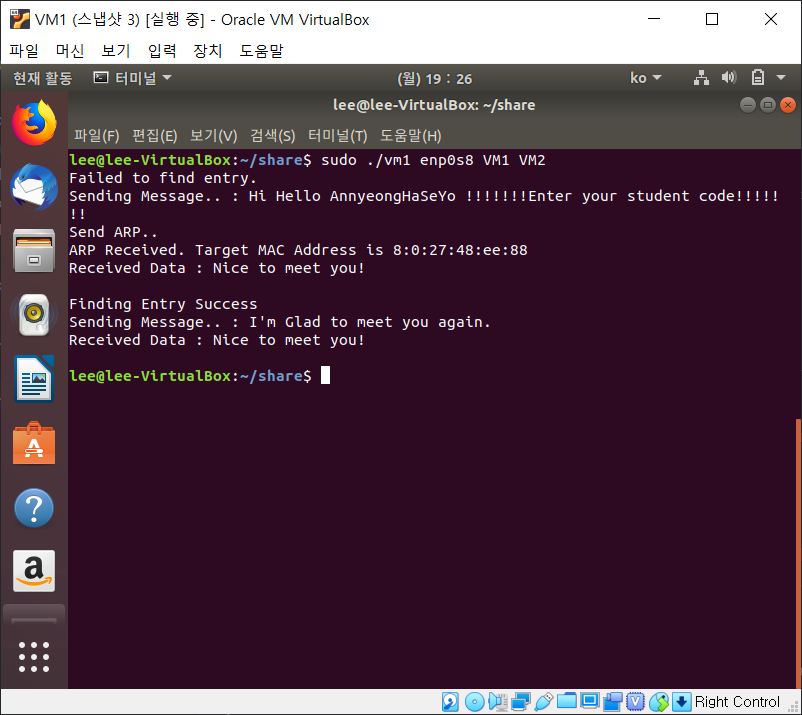
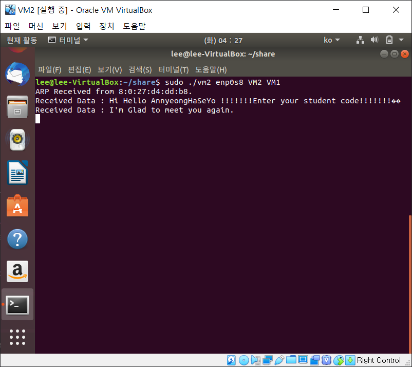

# Implementation Descriptions

## `int init_socket(unsigned short etype, int* sock);`

네트워크 소켓은 네트워킹을 위한 입출력이며 데이터 송수신을 위한 실질적인 창구 역할을 한다. 프로세스가 데이터를 송신 및 수신하기 위해서는 반드시 소켓을 열어서 소켓에 데이터를 써서 보내거나 소켓으로부터 데이터를 받아 읽어야 한다. 소켓 API는 응용 프로그램과 통신 프로토콜 간의 인터페이스를 위해 운영체제에서 제공되며, 특정 운영체제 및 프로그램 언어에 의존적으로 동작한다. 이 과제에서는 C언어로 네트워킹을 사용하는 응용 프로그램을 작성하여 ubuntu 상에서 실행하고자 하는 것이 목적이기 때문에, 소켓을 정의하고 initialization해서 통신 프로토콜을 사용할 수 있도록 해 주어야 한다. `init_socket` 함수가 해당 역할을 수행한다.

이 함수는 먼저 인자로 받은 int pointer인 `sock`이 지정하는 메모리가 제대로 할당되었는지 확인하고 `-1`로 초기화한다. 다음으로 소켓을 만들기 위해 `socket` 시스템 콜을 호출한다. `socket`이 성공적으로 수행되면 int 타입의 새로 만들어진 소켓 번호가, 에러가 발생하면 `-1`이 return된다. `socket`의 첫 번째 인자로는 프로토콜 체계 중 리눅스에서 패킷 캡쳐를 위해 사용하는 `PF_PACKET`을, 두 번째 인자로는 서비스 타입 중 TCP나 UDP를 거치지 않고 바로 IP 계층을 사용하는 Raw 방식인 `SOCK_RAW`를, 세 번째 인자로는 사용할 프로토콜로 `init_socket` 함수에서 인자로 받은 `etype`의 바이트 순서를 Host to Network로 바꾼 `htons(etype)`을 넘긴다. 이때 `etype`은 소켓에서 사용되는 프로토콜을 ethertype으로 지정하는 것인데, `etype`을 `ETH_P_ALL`로 설정했다면 소켓을 하나만 열고도 모든 프로토콜에 대한 패킷을 교환할 수 있다. 이 과제에서는 서로 다른 ethertype으로 지정한 ARP request/reply와 data packet을 교환할 것이기 때문에 `ETH_P_ALL` 인자로 init_socket 함수를 호출하게 된다. `socket`을 호출한 뒤, 에러가 발생했는지 여부를 확인한다.

`ifreq` 구조체는 `ioctl` 함수를 이용해 장치의 이더넷 인터페이스 정보를 수집하기 위해 사용한다. `init_socket` 함수는 먼저 선언된 구조체 전체를 0으로 초기화하고, `ioctl`의 대상으로 삼고자 하는 인터페이스의 이름인 전역변수 `interface`를 구조체의 멤버인 `ifr_name`에 설정한다. `ioctl` 함수는 입출력 장치 제어와 정보를 얻기 위해 사용한다. `init_socket` 함수는 설정한 `ifreq` 구조체를 세 번째 인자로 해서 `ioctl` 함수를 호출한다. 이때 첫 번째 인자는 앞서 만들어진 소켓이고, 두 번째 인자는 `ioctl.h`에 정의되어 있는 `SIOCGIFHWADDR`이 되도록 호출이 이루어진다. 이렇게 `ioctl` 함수를 호출하게 되면 해당 장치에서 사용하는 이더넷 interface에 대한 하드웨어 주소(mac address)의 정보가 `ifreq.ifr_hwaddr.sa_data`에 설정된다. 이 정보를 전역변수 `STATION_ADDR`로 사용하게 된다.

`init_socket` 함수는 동일한 방식으로 `ifreq` 구조체를 다시 초기화하고 `interface`를 `ifr_name`에 설정한 뒤, 이번에는 두 번째 인자를 `SIOCGIFINDEX`로 해서 `ioctl` 함수를 호출한다. 이렇게 하면 연결된 소켓에서 사용하는 인터페이스의 인덱스 번호가 `ifreq.ifr_ifindex`에 설정된다. 다음으로는 앞서 만든 연결되지 않은 소켓에 주소, 프로토콜, 포트를 할당하는 binding을 해 주어야 한다. 이더넷 헤더에 해당하는 부분까지 조작하여 데이터를 주고받을 것이기 때문에 Data Link Layer 수준에서 패킷을 조작할 수 있도록 설정해야 한다. bind 함수의 두 번째 인자로 소켓에 부여할 주소정보를 포함한 구조체를 사용하는데, 일반적인 network layer에 대한 IP 주소가 담긴 구조체를 대신하여 `sockaddr_ll` 구조체를 사용하여 Link Layer의 header 정보를 전달하고 특정한 인터페이스를 지정하도록 한다. `init_socket` 함수는 먼저 구조체 전체를 초기화한 뒤, 구조체 내부의 `sll_ifindex`로는 앞서 받아온 ifreq.`ifr_ifindex`로 설정하고, `sll_family`는 패킷 캡쳐를 위해 `AF_PACKET`으로 설정하며, `sll_protocol`로는 동일하게 `htons(etype)`을 설정한다. 이 구조체를 가지고 앞서 만든 소켓에 대해 `bind` 함수를 호출해 패킷 소켓으로 사용할 수 있도록 binding한다. `bind`를 호출한 뒤, 제대로 binding이 되었는지 확인하는 절차를 거친다.

`init_socket` 함수는 마지막으로 binding된 소켓에 대해 `setsockopt` 함수를 호출해 소켓 옵션을 조작해서 세부사항을 조절한다. `SOL_SOCKET` 레벨의 `SO_BINDTODEVICE` 옵션으로 전역변수 interface를 주어 특정 인터페이스에서 들어오는 패킷만 받도록 결정하는데, 이를 통해 현재 장치의 이더넷 인터페이스인 전역변수 interface에 대한 패킷만 받도록 할 수 있다. 역시 제대로 binding이 되었는지 확인하는 절차를 거친다. 만들어진 소켓의 주소는 side effect로 `init_socket `함수의 두 번째 인자로 들어온 int pointer인 `sock`에 저장된다.

## `void dispatchReceivedFrame(unsigned char* ptr);`

`ETH_P_ALL` 옵션으로 소켓을 열도록 설정했기 때문에 열린 소켓은 인터페이스로 들어오는 모든 프로토콜의 패킷을 수신한다. 따라서 서로 다른 ethertype으로 지정한 ARP request/reply와 data packet을 받게 되면 이를 구분할 필요가 있고, 이 응용 프로그램이 다루지 않지만 원하지 않게 이루어지는 IPv4 프로토콜 등의 통신은 무시하도록 해야 한다. `dispatchReceivedFrame` 함수가 받은 패킷을 분석해서 각 특징에 맞게 분석할 수 있도록 한다.

`dispatchReceivedFrame` 함수는 `ptr`을 이용해 이더넷 헤더와 body를 구분하고, 이더넷 헤더에서 ethertype 값을 분리해낸다. 이때 받은 프레임이므로 ethertype의 바이트 순서를 Network to Host로 바꾸기 위해 `ntohs` 함수를 사용한다. ethertype에 대해 switch문을 사용해서 ARP의 ethertype으로 지정한 `0xFFFE`라면 `receiveARPFrame` 함수를 호출하고, data의 ethertype으로 지정한 `0xFFFD`라면 `receiveDataFrame` 함수를 호출한다. 이때 `dst`로는 이더넷 헤더에서 분리하여 패킷을 보낸 장치의 mac address인 source address를, 각각 ARP와 data로는 패킷에서 이더넷 헤더를 제외한 body 부분의 주소인 `ptr`을 인자로 사용한다. 나머지 지정되지 않아 대상으로 삼지 않는 ethertype들에 대해서는 함수를 호출하지 않고 모두 무시한다.

## `void receiveARPFrame(unsigned char* dst, unsigned char* arp);`

받은 패킷의 ethertype이 `0xFFFE`인 경우 호출되는 `receiveARPFrame` 함수는 받은 ARP 프레임을 어떻게 처리할지를 다룬다. 이 함수는 받은 ARP request의 receiver가 자신인지 확인한 뒤에 자신이 아니면 무시하고, 자신이면 이에 대한 ARP reply를 보낸다.
`receiveARPFrame` 함수가 받는 첫 번째 인자인 `dst`는 `dispatchReceivedFrame` 함수에서 넘긴 값으로, 패킷을 보낸 장치의 mac address를 의미한다. `receiveARPFrame` 함수는 먼저 어디에서 ARP 패킷을 받았는지를 콘솔에 출력한다.

다음으로는 `receivedId 값에 `대한 allocation을 진행해야 한다.

```c
    receivedId = malloc((ra->len)+1);
    memcpy(receivedId, ra->data, (ra->len)+1);
```

받은 ARP 프레임의 `data` 부분에 ARP로 호출하고자 하는 대상의 VM name이, `len` 부분에 그 길이가 포함되어 있으므로, 이를 `receivedId` 변수에 allocation 해주면 된다. 이때 strcmp에서 string의 구분을 string 마지막의 `NULL`값으로 하므로 원래 length보다 1 큰 값으로 allocation과 `memcpy`를 해 주면 마지막에 `NULL` 값이 allocation된다. `receivedId`과 자신의 VM name을 비교해서 ARP의 대상이 자신인지 확인하고, 자신이 아니면 무시한다고 출력하고 프레임 처리를 마친다.

ARP의 receiver가 자신이라면 ARP의 목적에 맞게 sender에게 자신의 mac address를 알려주도록 reply를 해야 한다.

```c
    mah->len = strlen(name);
    memcpy(mah->ethAddr, STATION_ADDR, sizeof(char)*6);
    memcpy(mah->data, name, strlen(name));
```

`data`로는 자신의 VM name, `ethAddr`로는 자신의 mac address에 해당하는 전역변수 `STATION_ADD`을를 보내면 ARP reply의 역할을 수행할 수 있다. 해당 정보를 `memcpy`로 프레임에 넣어준다. 만들어진 프레임을 ARP에 해당하는 ethertype인 `0xFFFE`로 sender에 보내 ARP reply를 한다.

## `void receiveDataFrame(unsigned char* dst, unsigned char* data);`

받은 패킷의 ethertype이 data에 해당하는 `0xFFFD`인 경우 호출되는 `receiveDataFrame` 함수는 받은 data 프레임을 어떻게 처리할지를 다룬다. VM1과 VM2에서는 모두 받은 data 자체를 콘솔에 출력해주며, VM2에서는 추가로 패킷을 받은 대상에게 답변으로 “Nice to meet you!”라는 Data packet을 보내준다.

## `struct registered_dst* findEntry(char* id);`

Data Link Layer 수준에서 패킷을 보내기 위해서는 목적지의 mac address를 알아야 한다. 한 번 이상 통신을 했던 목적지의 mac address는 ARP cache에 목적지에 대한 identifier를 통해 검색하여 찾아낼 수 있고, 한 번도 통신을 하지 않았다면 ARP cache에서 identifier로 검색을 해도 저장된 정보가 없어 address에 대한 resolution procedure를 진행해야 한다. `findEntry` 함수는 이러한 과정 중 identifier를 통한 ARP cache에 대한 탐색을 진행한다.

ARP cache는 linked list로 구현되어 있기 때문에 하나씩 entry를 넘어가면서 찾고자 하는 identifier와 일치하는 entry가 있는지 탐색하고, 탐색 여부를 콘솔에 출력한다. 일치하는 entry를 찾았다면 해당 entry를 return하고 일치하는 entry가 없다면 `NULL`을 return한다.

## `void sendARPRequest(char* id);`

`sendARPRequest`는 address에 대한 resolution procedure에서 ARP request에 들어가야 할 정보를 담아 프레임을 만드는 과정을 담당한다.

```c
    mah->len = strlen(id);
    unsigned char DST[] = { 0x00, 0x00, 0x00, 0x00, 0x00, 0x00 };
    memcpy(mah->ethAddr, DST, sizeof(char)*6);
    memcpy(mah->data, id, strlen(id));
```

ARP request를 보낼 때는 mac address를 받고자 하는 기기의 identifier를 data로 담아서 ARP request를 받은 기기들이 자신이 request의 대상인지를 확인하고 reply를 보낼지 여부를 결정하도록 해야 한다. ARP request를 보낼 때는 Ethernet header에 source address로 자신의 mac address가 들어가므로 ARP reply와 달리 `DST`로 자신의 mac address를 보낼 필요는 없고, 전부 `0` 비트로 초기화하면 된다. 이러한 정보들을 `mah` 구조체에 담아 ARP request 프레임을 만들어낸다.

ARP request는 unicast가 아니라 broadcast로 만든 프레임을 전송하는데, 모든 기기들이 이 패킷을 받아 대상으로 하는 기기만이 ARP reply를 보내도록 처리 과정을 거치게 된다. 만들어진 프레임을 ARP에 해당하는 ethertype인 `0xFFFE`로 보낸다.

## `struct registered_dst* waitARPReply(char* id);`

`waitARPReply`는 address에 대한 resolution procedure에서 ARP request를 보낸 뒤에 이에 대한 reply를 받기 위해 대기하고, reply를 처리해 ARP cache에 저장하는 과정을 담당한다.

먼저 `recv` 함수를 호출해서 소켓으로부터 일반 데이터를 수신하고, 수신한 데이터를 buffer에 저장하는 과정을 무한히 반복하도록 한다. 이더넷 헤더를 분리해 타입 변환을 해주고, 만약 ethertype을 Network to Host로 변환한 값이 ARP에 할당된 값인 `0xFFFE`가 아닌 경우 무시하고 다시 소켓으로부터 데이터를 수신하도록 대기한다.
ethertype이 `0xFFFE`인 ARP 패킷인 경우에만 처리를 하는데, 이 ARP 패킷이 자신이 보낸 ARP request에 대한 reply에 해당되는지를 확인하기 위해 `receivedId`와 `id`를 비교하는 과정을 먼저 거친다. 만약 request에 대한 reply가 아니면 역시 무시하고 다시 데이터를 수신하도록 대기한다.

```c
    receivedId = malloc((mah->len)+1);
    memcpy(receivedId, mah->data, (mah->len)+1);
```

`receivedId`에 대한 allocation의 방법은 앞서 `receiveARPFrame`에서 한 것과 동일하다.
자신의 request에 대한 reply라는 것이 확인되면 받은 mac address를 콘솔에 출력해주고, 새로운 entry를 만들어서 ARP cache에 저장한다. 다시 `findEntry` 함수를 호출해 entry를 찾을 필요가 없도록, `findEntry` 함수와 동일하게 해당 entry를 return한다.

```c
    newEntry->id = receivedId;
    memcpy(newEntry->dst, mah->ethAddr, sizeof(char)\*6);
    newEntry->next = NULL;
    ptr->next = newEntry;
```

entry의 `id`는 identification에 사용하는 name인 `receivedId` (`id`와 동일한 값), `dst`는 sender가 ARP 프레임의 `ethAddr`에 넣어서 보낸 자신의 mac address를 넣어 나중에 findEntry 함수가 identifier로 식별할 수 있도록 한다. 만들어진 entry는 ARP cache의 맨 마지막에 삽입하기 때문에, 현재 마지막 위치인 `ptr->next`에 `newEntry`를, `newEntry->next`에 `NULL`을 할당한다.

## `void sendFrameTo(char* id, unsigned short type, unsigned char* data, int len);`

`sendFrameTo` 함수는 Data Link Layer 수준에서 패킷을 보내기 위해서 반드시 알아야 하는 패킷을 보내고자 하는 destination의 mac address를 모를 때 mac address 대신 identifier를 인자로 받아 mac address를 찾아내고, 다시 이 정보로 실제 패킷을 보내는 `sendFrame` 함수를 호출하기 위해 사용하는 중간 과정 격의 함수이다.
먼저 `findEntry` 함수로 identifier를 통한 ARP cache에 대한 탐색을 진행한다. 만약 한 번도 통신을 하지 않아 ARP cache에서 identifier로 검색을 해도 저장된 정보가 없다면 findEntry 함수에 의해 entry에 `NULL` 값이 return되며, 이러한 경우에는 address에 대한 resolution procedure를 진행해야 한다. Address resolution procedure는 ARP request를 보내고 reply를 받아 identifier에 해당하는 mac address를 얻어내고 ARP cache에 저장하는 과정으로, `sendARPRequest`와 `waitARPReply` 함수를 순서대로 호출함으로써 이루어진다.

`sendFrameTo` 함수는 결론적으로 ARP cache 탐색이나 Address resolution procedure로 `entry`를 얻어내며, `entry`에 저장된 목적지의 mac address인 `dst`를 찾아서 나머지 정보와 함께 실제 패킷을 보내는 `sendFrame` 함수를 호출한다.

## `void sendFrame(unsigned char* dst_mac, unsigned short type, unsigned char* data, int len);`

`sendFrame` 함수는 목적지의 mac address, 프로토콜 type, 보내고자 하는 data, data의 길이를 받아서 프레임 payload를 만들고, 실제로 프레임을 전송하는 역할을 하는 함수이다.

```c
    memcpy(eh->destaddr, dst, sizeof(char)*6);
    memcpy(eh->srcaddr, STATION_ADDR, sizeof(char)*6);
    eh->etherType = htons(type);
```

프레임의 이더넷 헤더는 이더넷 헤더의 구조에 맞게 DA, SA, type의 세 가지 정보를 정확하게 가지도록 해야 한다. Destination address로는 함수의 인자로 받은 `dst` 값을, Source address로는 패킷을 보내는 자신의 mac address 값을 사용하면 정확하다. ethertype 역시 함수의 인자로 지정된 type 값을 사용하면 되는데, network 상으로 전달하는 것이기 때문에 host to network로 바이트 순서를 바꿔주어야 한다. 순서를 바꾸지 않으면 받는 과정에서 잘못된 ethertype으로 인식한다.

```c
    memcpy(msgbuf_wrptr, (unsigned char*)eh, sizeof(struct eth_header));
    msgbuf_wrptr += sizeof(struct eth_header);
    memcpy(msgbuf_wrptr, data, len);
    msgbuf_wrptr += len;
```

다음으로는 만든 이더넷 헤더와 보내고자 하는 데이터를 프레임 payload로 만들어 `msgbuf`에 저장해 주어야 한다. 메모리로 할당된 `msgbuf`의 처음을 가리키는 `msgbuf_wrptr` 포인터를 이용해서 payload를 작성할 수 있다. 전체 프레임의 처음에는 이더넷 헤더가 들어가야 하므로 `memcpy` 함수를 사용해서 이더넷 헤더 구조체의 정보를 `msgbuf`에 할당한다. 이때 `struct eth_header*` 타입이었던 이더넷 헤더를 `unsigned char*` 타입으로 형변환을 해 타입을 맞춰 주어야 손실 없이 정보를 전송할 수 있다. 다음 정보를 적절한 위치에 삽입할 수 있도록 하기 위해 `msgbuf_wrptr`의 위치를 이더넷 헤더의 길이만큼 이동시켜 준다.

보내고자 하는 데이터가 이더넷 헤더 다음으로 들어가며, 역시 `memcpy` 함수를 사용해서 data의 길이인 `len`만큼 payload를 작성할 수 있다. 마지막으로 `msgbuf_wrptr`의 위치를 또다시 `len`만큼 이동시켜 주는데, 이는 전체 프레임의 길이를 `msgbuf_wrptr`과 처음 위치 간의 차를 이용해서 구해 `send` 함수를 사용하기 때문이다. 전체 프레임 payload를 모두 작성하면 `send` 함수를 호출해서 소켓을 통해 msgbuf에 적은 payload를 전송하고, 할당한 buffer는 allocation을 해제해준다.

## `int main(int argc, char* argv[])`

지금까지 알아본 각 함수의 역할을 토대로 `main` 함수의 정보를 통해 전체적인 코드의 흐름을 살펴볼 수 있다. 먼저 전역변수를 살펴보면 소켓 정보를 담는 `int sock_ll`, 자신의 이더넷 interface 정보를 담는 `char* interface`, 자신의 장치 identifier 이름을 담는 `name`, ARP cache를 담는 `struct registerd_dst dst list`가 있고, 자신의 station address를 담는 `unsigned char STATION_ADDR[]`은 전부 `0x00`으로 초기화되어 있으며, broadcast에서 사용하는 mac address를 담는 `unsigned char BROADCAST_ADDR[]`은 전부 `0xff`의 값을 가진다.

`main` 함수의 공통적인 부분을 보면, 먼저 프로그램을 실행할 때 지정해준 명령 행의 옵션들을 변수에 저장해준다. 자신의 이더넷 interface 정보, 자신의 장치 identifier 이름, peer의 장치 identifier 이름을 프로그램 실행 시 함께 받아서 사용한다. 이때 내부적으로 `malloc` 함수를 호출해 문자를 복사하고 복사된 문자열을 가리키는 포인터를 반환하는 `strdup` 함수를 사용한다. 다음으로 ARP cache의 next에 `NULL`값을 지정해 초기화한다. 다음으로 `init_socket` 함수를 호출해 프로그램에서 사용할 소켓을 여는데, 이때 앞서 확인한 것처럼 type 인자로 `ETH_P_ALL`을 주어 모든 프로토콜의 송수신을 소켓 하나로 처리할 수 있도록 한다. 열린 소켓의 정보는 side effect를 통해 전역변수 `sock_ll`이 가리키게 된다. 만약 소켓을 여는데 에러가 발생하면 `init_socket` 함수는 `-1`을 return하며, 이를 받은 `main` 함수는 오류 메시지를 출력하고 프로그램을 종료한다.

VM1이 실행하는 main code를 살펴보면 VM1이 어떤 역할을 하는지 확인할 수 있다. 먼저 `sendFrameTo` 함수를 호출해서 peer의 identifier로 "Hi Hello AnnyeongHaSeYo !!!!!!!Enter your student code!!!!!!!" data를 보낸다. 이때 `sendFrameTo` 함수는 `findEntry` 함수를 호출해 ARP cache에 peer의 identifier 정보가 있는지 확인하고, 정보가 없으므로 Address resolution procedure를 진행한다. ARP request를 `sendARPRequest`를 호출해 보내고, 이에 대한 reply를 `waitARPReply` 함수를 호출해서 받는 과정을 통해 peer의 identifier에 해당하는 mac address를 얻어내고 ARP cache에 저장한다. Address resolution procedure가 완료되면 peer의 mac address를 알 수 있고, 이 정보를 토대로 `sendFrame` 함수를 호출해 실제로 보내고자 했던 data를 보내게 된다.

다음으로는 `recv` 함수를 호출해 패킷을 받아 `dispatchReceivedFrame` 함수를 호출한다. 이는 VM2가 앞서 보낸 data에 대한 reply를 받기 위함이다. `dispatchReceivedFrame` 함수는 받은 패킷의 이더넷 헤더를 분석해 ethertype이 data frame에 할당한 `0xFFFD`임을 확인하고, data frame을 처리하는 `receiveDataFrame` 함수를 호출한다. VM1에서는 `receiveDataFrame` 함수가 단순히 받은 데이터를 콘솔에 출력해준다.
다음으로는 다시 `sendFrameTo` 함수를 호출해서 peer의 identifier로 "I'm Glad to meet you again." data를 보낸다. `sendFrameTo` 함수는 `findEntry` 함수를 호출해 ARP cache에 peer의 identifier 정보가 있는지 확인하고, 이번에는 정보가 있으므로 entry를 받아와 peer의 mac address를 바로 얻어낸다. 이 정보를 토대로 `sendFrame` 함수를 호출해 실제로 보내고자 했던 data를 보내게 된다. 마지막으로 다시 reply를 받기 위해 `recv` 함수를 호출해 패킷을 받아 `dispatchReceivedFrame` 함수를 호출하고, 소켓을 닫은 뒤 프로그램을 종료한다.

VM2의 main code는 보다 더 간단한데, `recv` 함수를 호출해 패킷을 받아 `dispatchReceivedFrame` 함수를 호출해 받은 패킷을 처리하는 과정을 무한히 반복하도록 되어있다. VM1이 처음으로 보낸 ARP request에 대해서는 `dispatchReceivedFrame` 함수가 ethertype이 ARP에 해당하는 `0xFFFE`임을 확인하고 `receiveARPFrame` 함수를 호출한다. `receiveARPFrame` 함수는 자신의 identifier와 ARP 프레임의 data를 비교해서 자신에 대한 요청인지 확인하는데, 이때는 자신에 대한 요청이므로 `ethAddr`에 자신의 mac address를 담아서 ARP reply를 보내게 된다. 이후로는 VM1이 data만을 보내게 되며, `dispatchReceivedFrame` 함수가 ethertype이 data에 해당하는 `0xFFFD`임을 확인하고 `receiveDataFrame` 함수를 호출한다. VM2에서 `receiveDataFrame` 함수는 받은 데이터를 콘솔에 출력하고 reply로 "Nice to meet you!\n" 데이터를 보내게 된다.
실제로 서로의 identifier를 peer로, 이더넷 interface를 내부 네트워크로 해서 프로그램을 실행하면 다음과 같은 결과를 얻는다. 이때 VM2에서 먼저 프로그램을 실행해서 패킷을 받을 준비를 하도록 한 뒤에 VM1을 실행해야 한다.

## Demo Execution Result Screenshots



